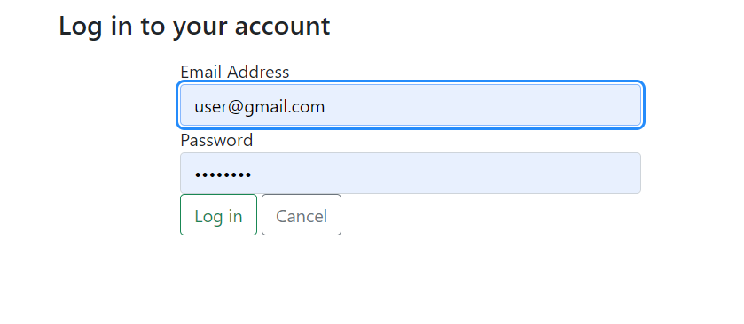
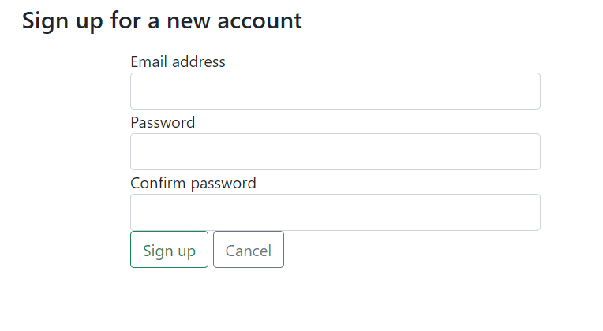
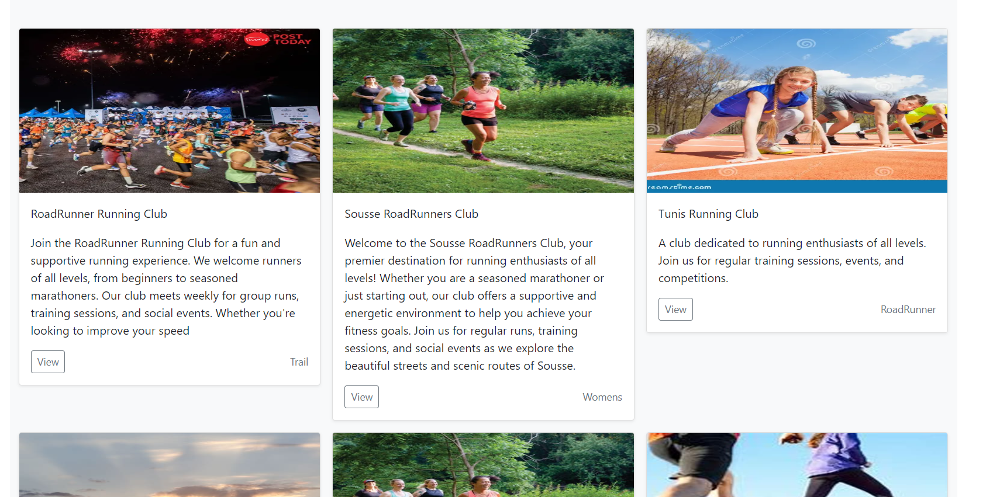
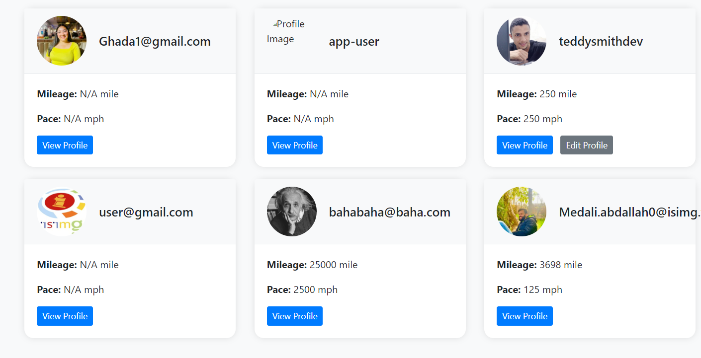
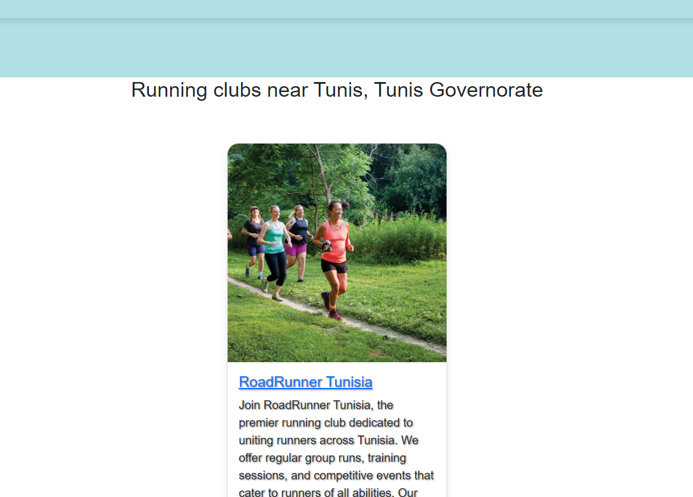

# RunTo Application

RunTo is an ASP.NET MVC application designed to help users find running clubs and races to practice sports. Below is a detailed overview of the application's current state and functionalities.

## Application Idea

The main idea of the RunTo application is to help users find running clubs and races to engage in physical activities. The application offers a range of functionalities for both regular users and administrators.

## Functionalities Implemented

1. **User Login and Registration**
   - Users can create an account and log in to access the application's features.
   - **Screenshot Placeholder**

2. **View Clubs and Races**
   - All users can view a list of available running clubs and races.
   - **Screenshot Placeholder**

3. **Admin Management**
   - Administrators can modify and delete clubs and races.
   - **Screenshot Placeholder**

4. **View Runners**
   - Users can view other runners in the application and modify their own profile.
   - **Screenshot Placeholder**

5. **Find Clubs by Location**
   - The application uses the user's IP address to find clubs in their region when accessing the home page, even without a search query.
   - **Screenshot Placeholder**

## Future Enhancements

Once the application is fully developed, we plan to share detailed documentation on the techniques used, the organization, and the logic of the packages. This will include:

- Detailed explanations of the implemented functionalities.
- Insights into the design and architecture of the application.
- Best practices followed during development.

## Contributing

If you are interested in contributing to this project, please follow these steps:

1. Fork the repository.
2. Clone your fork locally.
3. Create a new branch for your modifications.
4. Make your changes.
5. Submit a pull request.

Thank you for your interest in the RunTo application!

## Screenshots

1. **User Login and Registration**
   - 
  - 
2. **View Clubs and Races**
   - 

3. **View Runners**
   - 

4. **Find Clubs by Location**
   - 
