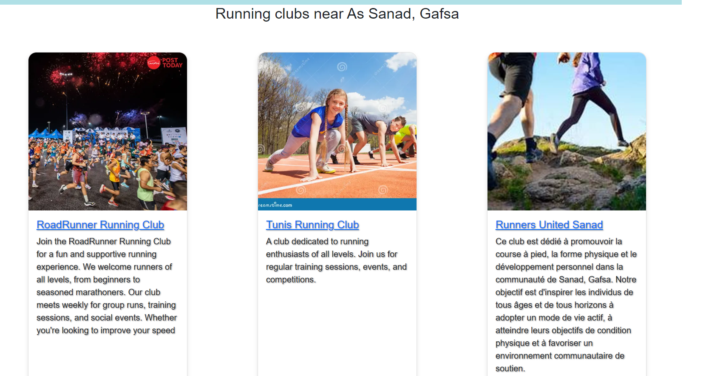

# 🏃‍♂️ RunTo Application

**RunTo** is an ASP.NET MVC application designed to help users find running clubs and races to engage in physical activities.

## 💡 Application Idea

The main idea of the **RunTo** application is to help users find running clubs and races to engage in physical activities. The application offers a range of functionalities for both regular users and administrators.

##  Implemented Features

1. **👤 User Registration and Login**
   - Users can create an account and log in to access the application's features.
  
2. **🏃 View Clubs and Races**
   - All users can view a list of available running clubs and races.

3. **🔧 Admin Management**
   - Administrators can modify and delete clubs and races.

4. **👥 View Runners**
   - Users can view other runners in the application and modify their own profiles.

5. **🌍 Find Clubs by Location**
   - The application uses the user's IP address to find clubs in their region when accessing the home page, even without a search query.

## 🛠 Future Enhancements

Once the application is fully developed, we plan to share detailed documentation on the techniques used, the organization, and the logic of the packages. This will include:

- Detailed explanations of the implemented functionalities.
- Insights into the design and architecture of the application.
- Best practices followed during development.

## 🤝 Contributing

If you are interested in contributing to this project, please follow these steps:

1. **Fork** the repository.
2. Clone your fork locally.
3. Create a new branch for your modifications.
4. Make your changes.
5. Submit a **pull request**.

Thank you for your interest in the **RunTo** application!

## 📸 Screenshots

### User Registration and Login

### View Clubs and Races

### View Runners

### Find Clubs by Location

#### Location: Tunis

#### Location: Snad, Gafsa

